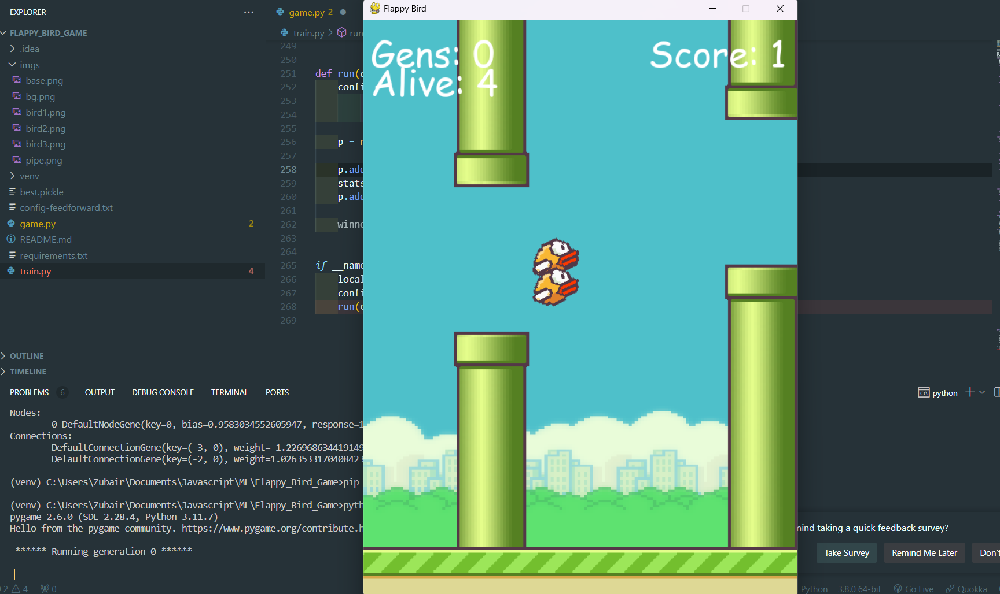

Here's an updated README file reflecting your project's structure. You can copy and paste this directly into your `README.md` file.

```markdown
# 🐦 Flappy Bird Clone 🐦




Welcome to the **Flappy Bird Clone** project, a classic arcade game built using Python and Pygame! 🕹️ This game features pixel-perfect collision detection using masks, making the gameplay smooth and engaging. 

## 🌟 Features

- **Pixel Perfect Collision**: Experience flawless interactions between the bird and pipes!
- **Dynamic Scoring**: Score points for every pipe you successfully navigate through! 🏆
- **Neat AI Integration**: Train a neural network to play the game using NEAT (NeuroEvolution of Augmenting Topologies) for a unique challenge! 🧠
- **Simple Controls**: Tap the space bar to make the bird jump! 

## 📦 Getting Started

### Prerequisites

- Python 3.x
- Pygame
- NEAT-Python

### Installation

1. **Clone the Repository**
   ```bash
   git clone https://github.com/ZubairZubii/flappy-bird-clone.git
   cd flappy-bird-clone
   ```

2. **Install Pygame**
   ```bash
   pip install pygame
   ```

3. **Install NEAT-Python**
   ```bash
   pip install neat-python
   ```

4. **Run the Game**
   ```bash
   python game.py
   ```

## 📽️ Watch the Game in Action!

Check out our gameplay video here: [Flappy Bird Gameplay](https://www.loom.com/share/d325e5d93d114f198e971fb4d61ca266?sid=22c206cf-64b5-4d14-8b1b-114cb113b3d3)

## 🎮 How to Play

- Press the **space bar** to make the bird jump.
- Navigate through the pipes without crashing.
- Enjoy the endless fun and see how far you can go! 🌈

## 🧩 Project Structure

```
FLAPPY_BIRD_GAME/
│
├── .idea/              # IDE configuration files
│
├── imgs/               # Contains images for the game
│   ├── base.png
│   ├── bg.png
│   ├── bird1.png
│   ├── bird2.png
│   ├── bird3.png
│   └── pipe.png
│
├── venv/               # Virtual environment directory
│
├── best.pickle         # File for storing the best model
├── config-feedforward.txt # NEAT configuration file
├── game.py             # Main game file
├── README.md           # Project documentation
├── requirements.txt    # List of required packages
└── train.py            # Training script for AI
```

## 💻 Built With

- [Python](https://www.python.org/) - Programming Language
- [Pygame](https://www.pygame.org/) - Game Development Library
- [NEAT-Python](https://neat-python.readthedocs.io/en/latest/) - NeuroEvolution of Augmenting Topologies

## 🌐 Connect with Me

- [GitHub](https://github.com/ZubairZubii)
- [LinkedIn](YOUR_LINKEDIN_PROFILE_HERE)

## 🤝 Contributing

Contributions are welcome! If you have suggestions for improvements or features, feel free to fork the repository and submit a pull request.

1. Fork the Project
2. Create your Feature Branch (`git checkout -b feature/AmazingFeature`)
3. Commit your Changes (`git commit -m 'Add some AmazingFeature'`)
4. Push to the Branch (`git push origin feature/AmazingFeature`)
5. Open a Pull Request

## 📄 License

Distributed under the MIT License. See `LICENSE` for more information.

---

Feel free to reach out if you have any questions or need further assistance! Happy coding! 🎉
```

### Notes:
- Replace `YOUR_VIDEO_LINK_HERE` with the actual link to your gameplay video.
- Replace `YOUR_LINKEDIN_PROFILE_HERE` with your actual LinkedIn profile link.
- Adjust any other sections as needed to suit your preferences.

This README file now accurately reflects the structure of your Flappy Bird game project and includes all necessary details for potential users and contributors!
